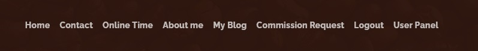
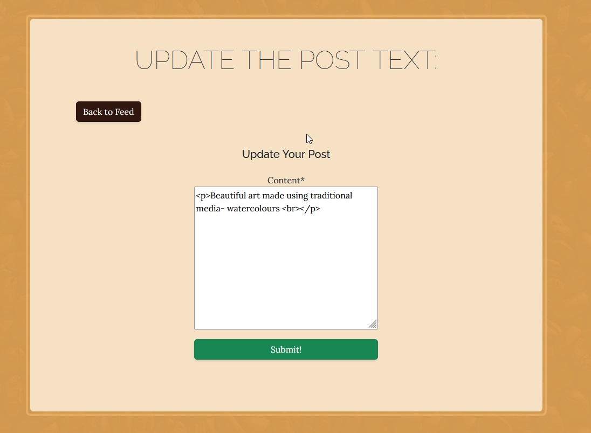
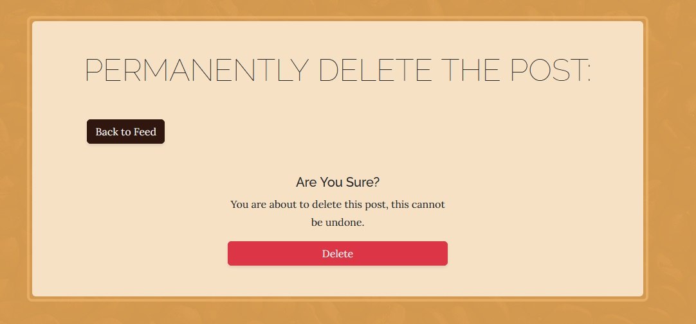
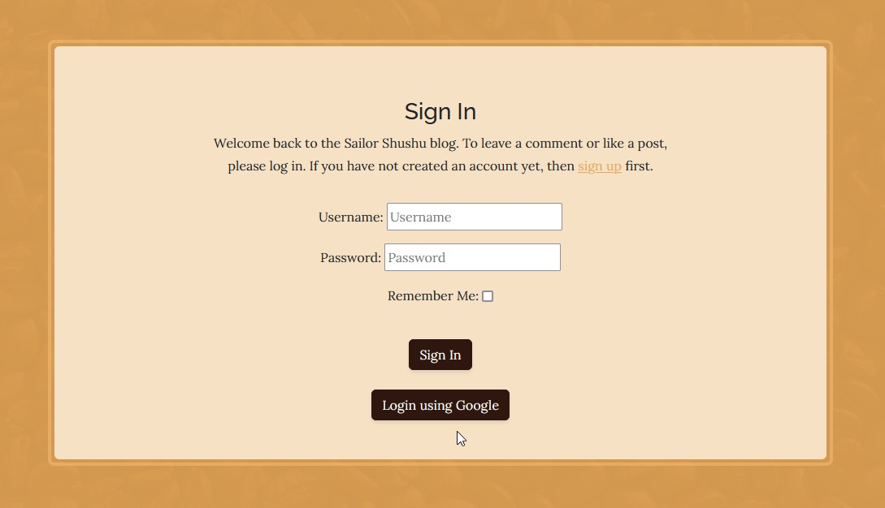
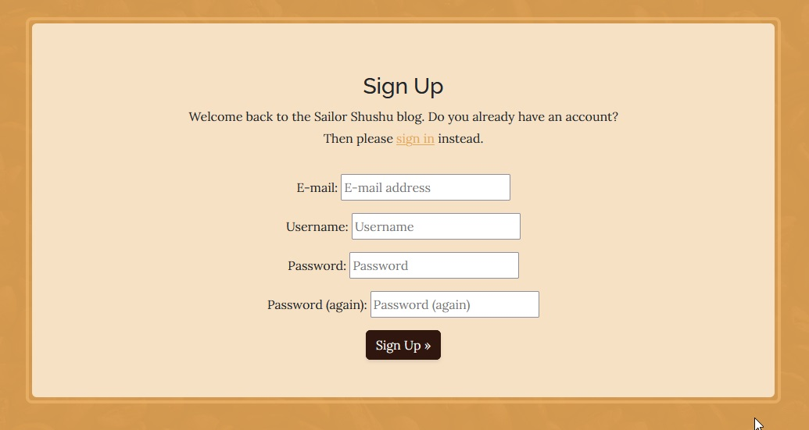
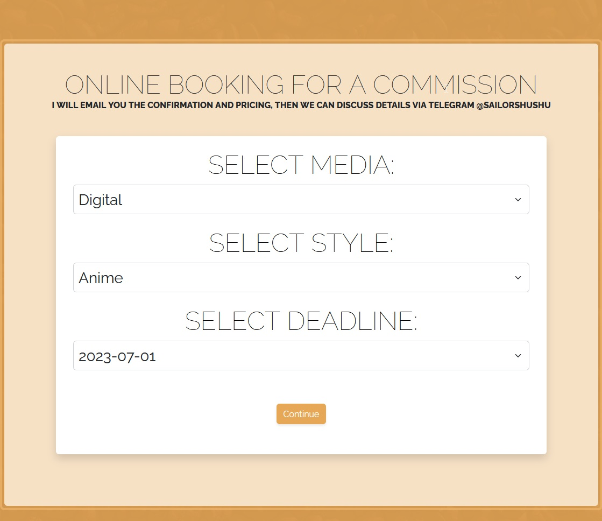
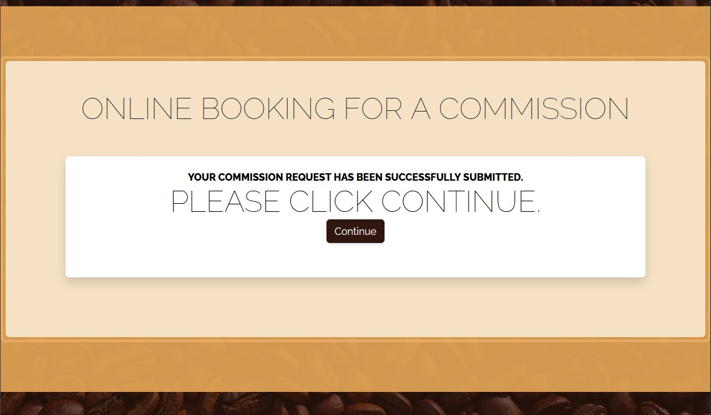
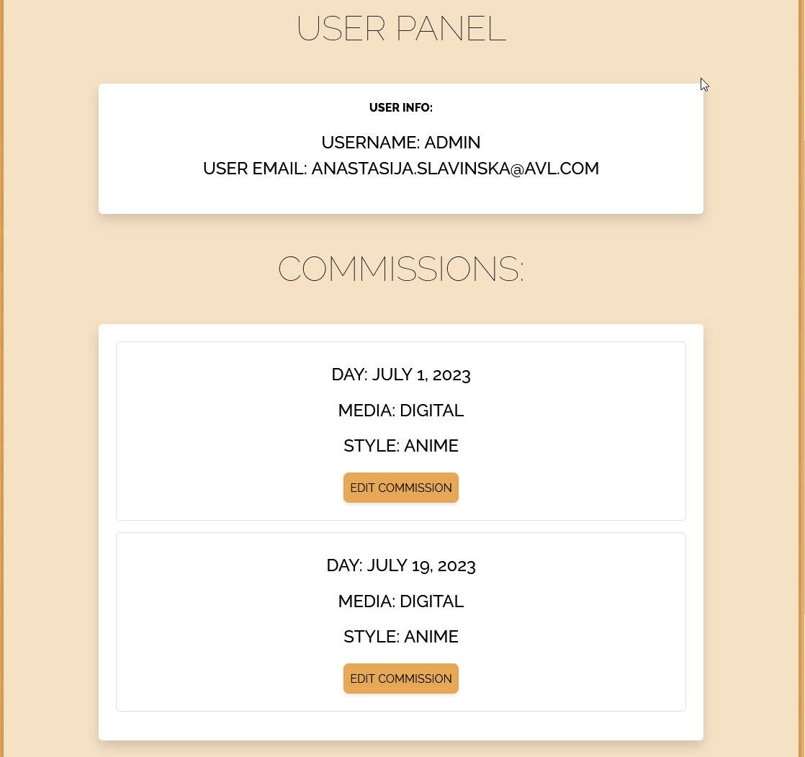
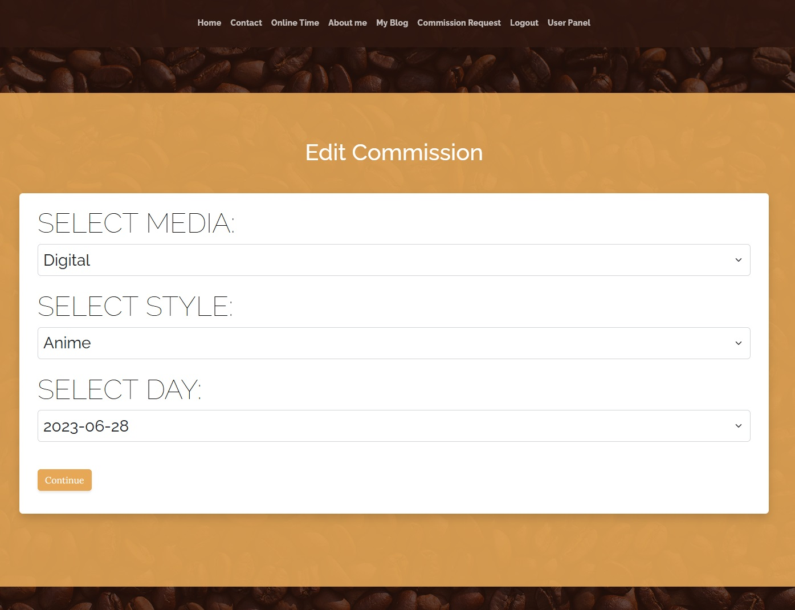
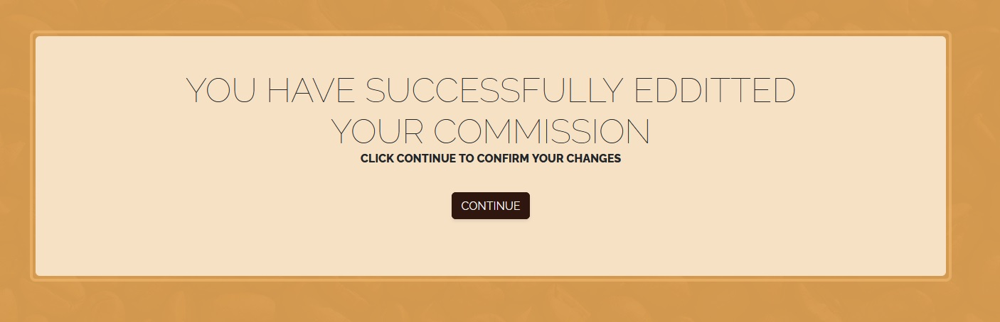

# Sailor Shushu blog
The official website of a British - Latvian Artist Sailor Shushu. This page is created for Sailor Shushu's fans of any age to enjoy her art and discuss it in a friendly community, support charities and to be able to contact Sailor Shushu for official communication in the blog and business offers via commission request tab.
Users of this will be able to find all the information they need to know about Sailor Shushu: About, Online times when users can chat with the artist real time, My blog page to disccus new art and book ideas, Booking online for comission requests. This site is targeted towards Sailor Shushu's fans, who love her art and want to commiunicate with her. 

# Features

- **Navigation**
    - Featuring at the top of the main page, the name of the artist Sailor Shushu and above that is the main menu.
    - The other navigation links are: Home, Online Time, About me, My Blog , Login/Logout and Register options. 
    - The navigation is in a font visible and readable for a user and color that contrasts with the background. 
    - The navigation clearly tells to the user the name of the app and website, and makes the different sections of information easy to find. 
    - The coffee theme is chosen as the artist drinks lots of coffee and without the magical drink her art wil not be possible.

    

    After User loges in, the menu panel will look like this: 

    

- **The Header**
    - The header shows the name of the app, using the other color chosen: Shade of Orange with hand writing type of font theme. 
    - Thi section provides the user with clear information about what the site is and who is the targetted audience. 

- **The Online Times Section**
    - Highlights online timing when the artist is available to respond to user comments real time.

- **The About Me Section**
    - The about section gives details about the SailorShushus background.
    

- **My Blog** 
    - This section contains posts featuring art and small stories behind each art. 
    - Users can like and comment posts after login in or registering 
    - Users can read other comments
    - Only the admin is able to edit posts using UI and not in the admin menu.
    - Only the admin is able to delete a post without login in to admin menu.
    - In order to approve useer comments he admin needs to login to the admin menu.
    - In the blog view number of likes and comments is visible under each post. 
    

    - When a post is opened the the admin will see edit and delete post buttons, that will allow the admin to update posts without going into the admin menu. 
    

    - When a user is logged in the user will be able to like the posts and leave comments. 

    

    - When a comment is submitted a user will see a message that the comment has been submitte for the approval and the admin must approve comments before they can appear under the post. 

    

    - The admin or the author of the blog can edit or delete the post

     
     

-**Login/Logout/Register**

    - Users can register using their email and password, the admin needs to approve every user in  the admin menu
    - Users are able to use a google account to register, the website will redirect them to the google sign in menu.

   

    - Register panel: 

    

-**Commission Request**

    - Here user will be able to request a commission from the artist.

    - After user click continue a confirmation tab will be opened. 

-**User Panel**
    - Here users will be able to find their details username and email and commission requests that they have submitted in the Commission Request menu. 

    - When user click on edit button the user can edit their commission request

    - The User will be redirected to the final notification message before redirecting back to the user panel main page.

-**Footer**
 - The fotter includes social media links, so users can find SailorShushu's twitter and instagram pages.
    
    

# Project Agile Kanban board:
 - The project kanban board can be found [here](https://github.com/users/aslavinska/projects/2/views/1)

# Testing
 - I have tested this page in brosers: Chrome and Firefox.
 - I confimed that this project is responsive, looks good and functions on all standard screen sizes using the devtools device toolbar.
 - I confirmed that the navigation, home, online time, about me,my blog and login/register/logout are all readable and easy to understand. 
 - I have confirmed that the form works: requires entries in every field, will only accept an email in the email field and the submit button works. 
 - I can confirm that post edit and delete functions work in the UI and models are updated without entering the admin panel.
 
 - User Story 1 Site Pagination Tests: 
        
    1. Verified that pagination is shown on the page load.
    2. Made sure that the default page should be selected on the page load.
    3. Checked proper space should be added for clicking on the links and buttons for both mobile and desktop screens.
    4. Made sure colour the text is changing when hover over the menu.
    5. Verified the font size and color for the pagination should be same as per design and requirement.
    6. Verified accurate results should be generated by clicking the buttons.
    7. Tested the data loading time on the page as the user clicks on the links.

- User Story 2 Open a post Tests:
    1. Verified that post is shown on the page load when clicked.
    2. Made sure comments are shown after approval. 
    3. Made sure number of likes and comments, text is shown in the main blog page and in the open post pages. 
    4. All menu links are working. 

- User Story 3 Manage Posts Tests:
    1. Made sure in the admin menu all CRUD functions are available to maintain the post. 

- User Story 4 Create Drafts
    1. In the admin menu draft and post options are available for the admin to choose. If Draft is selected the post will not be visible to any users on the main post page. 

- User Story 5 Approve Comments 
    1. The admin will get all comments for approval and will be able to use admin panel to approve the comments.

- User Story 6 - has been deleted an error was made 

- User Story 7 View Post List 
    1. In the main post view all posts are visible.
    2. Time and date of posting is clear and visible and author of the post is available to see.

- User Story 8  View Likes
    1. Number of likes and comments is clear under each post.

- User Story 9 View comments
    1. All comments that were approved by the admin are visible to users in comment section. 

- User Story 10 Account Registration 
    1. Verified that only users that are registered can comment and like posts and can request commisions and update their commission requests. 

- User Story 11 Comment on a post 
    1. Verified that only logged in users can comment on posts. 

- User Story 12 Like/Unlike 
    1. Verified that only logged in users can like and retrieve their like under a post. 

- User Story 13 Template looks and menu 
    1. Repeated tests from the user story 1. 

- User Story 14 Social App feature login 
    1. Verified that login via Google account is available and working 

- User Story 15 Display number of comments 
    1. Verified that logged in users can see number of comments under each post under post preview. 

- User Story 16 Edit Delete posts for admin 
    1. verified that only admin/post author can see edit and delete buttons inside each post. 
    2. verified that only admin/author can edit a post content 
    3. verified that only admin/author can delete a post. 

- User Story 17 Commission Request form 
    1. Verified that only logged in users can see commission request form
    2. verified that Admin can see in the admin menu commission requests under Appointment menu. 

- User Story 18 Edit Commission Request 
    1. Verified that only commission request author can edit the request from, all fields can be modified. 
    
 ## Bugs 
    - No known bugs

 ### Solved bugs
    - When users were trying to register the page was returning error 500, that was fixed by adding ACCOUNT_EMAIL_VERIFICATION as none. 

## Validator Testing 

- HTML 
    - No errors were returned when passing through the official [W3C validator](https://validator.w3.org/).
    - Every page has been checked and no errors or warnings have been highlighted. 
- CSS 
    - No errors were returned when passing through the official [(Jigsaw) validator](https://jigsaw.w3.org/).
- Accessibility
    - I confimed that the colors and fonts chosen are easy to read and accessible by running it through lighthouse in devtools. 
    
- JS 
    - No errors were found using [jshint validator](https://jshint.com/)

## Manual Testing

- Every page has been manually tested:
    - Screen resize on different devices 
    - Making sure everything is visible and does not look out of place 

## Unfixed Bugs

No unfixed bugs that have been identified. 

# Deployment 

The site was deployed to Heroku using followin steps:
1. Debug flag in setting.py is set to False
2. X_FRAME_OPTIONS was added to settings.py file and set to sameorigin
3. Everything added, committed and pushed to github. 
4. Disable collecstatic variable has been removed from the heroku app config vars list
5. In Heroku project in the deploy tab the main branch has been deployed. 

The lie link can be found here - [Sailor Shushu Art Blog ](https://aslavinska-project4.herokuapp.com/).

# Credits

## Content
The code example for layout and social media links was taken from Code Institute I think therefore I blog Project. 
The template for the Read.me file has been taked from Code Institute. 
Boot Strap Free template can be found here - [Template](https://startbootstrap.com/theme/business-casual)
Tutorial to add social media sign up can be found [here.](https://www.codesnail.com/google-authentication-in-django/)
Tutorial to edit and remove posts can be found [here.](https://legionscript.medium.com/building-a-social-media-site-with-python-and-django-part-4-edit-delete-posts-add-comments-8e6ca1ef0441)
Manual Test Examples can be found [here.](https://onlinetestcase.com/test-cases-for-pagination/)
Tutorial on Django booking system [here.](https://blog.devgenius.io/django-tutorial-on-how-to-create-a-booking-system-for-a-health-clinic-9b1920fc2b78)
## Media
All images in the blog and main pages were take from private Sailor Shushu official archives. All rights reserved.