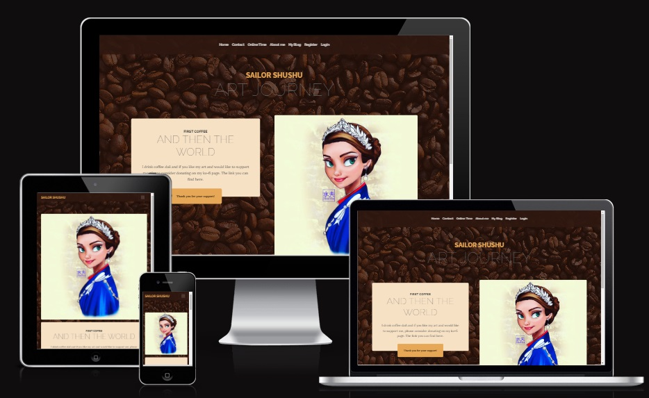
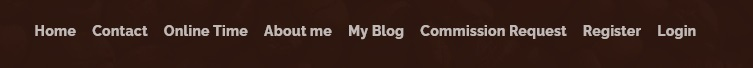
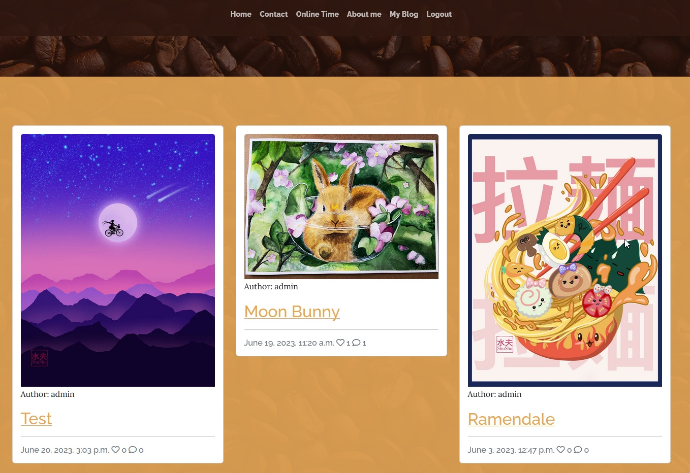
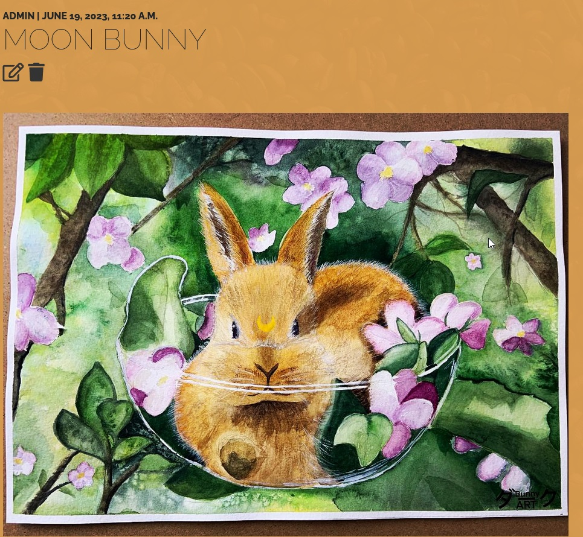
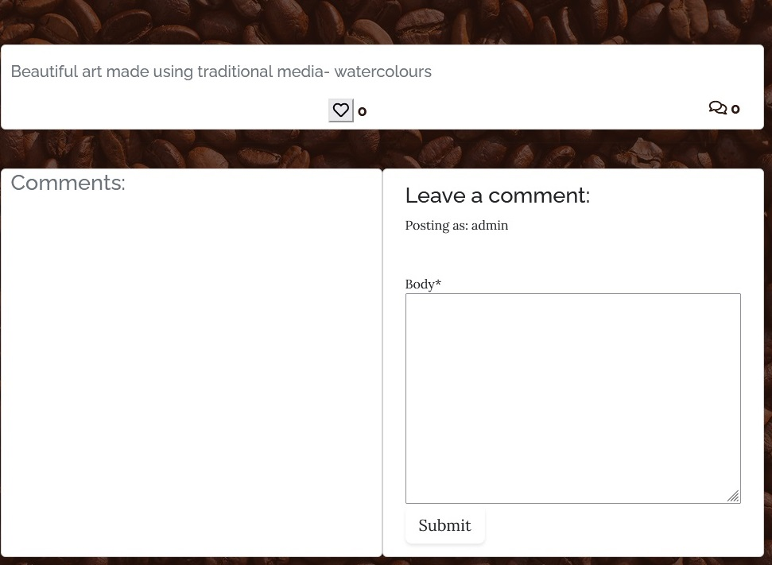
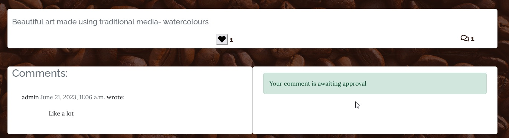
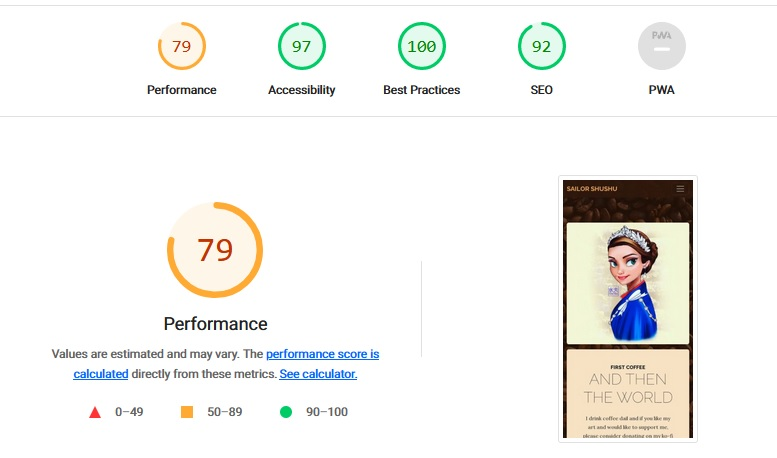

# Sailor Shushu blog
The official website of a British - Latvian Artist Sailor Shushu. This page is created for Sailor Shushu's fans of any age to enjoy her art and discuss it in a friendly community, support charities and to be able to contact Sailor Shushu for official communication abd business offers.
Users of this will be able to find all the information they need to know about Sailor Shushu: About, Online times when users can chat with the artist real time, Contact form for business enquires, My blog page to disccus new art and book ideas. This site is targeted towards Sailor Shushu's fans, who love her art and want to commiunicate with her. 

# Features

- **Navigation**
    - Featuring at the top of the main page, the name of the artist Sailor Shushu and above that is the main menu.
    - The other navigation links are: Home, Contact, Online Time, About me, My Blog , Login/Logout and Register options. 
    - The navigation is in a font visible and readable for a user and color that contrasts with the background. 
    - The navigation clearly tells to the user the name of the app and website, and makes the different sections of information easy to find. 
    - The coffee theme is chosen as the artist drinks lots of coffee and without the magical drink her art wil not be possible.

    

- **The Header**
    - The header shows the name of the app, using the other color chosen: Shade of Orange with hand writing type of font theme. 
    - Thi section provides the user with clear information about what the site is and who is the targetted audience. 

- **The Contact Me Section**
    - The contact me section has a form to contact Sailor Shushu for business purposes only. 

- **The Online Times Section**
    - Highlights online timing when the artist is available to respond to user comments real time.

- **The About Me Section**
    - The about section gives details about the SailorShushus background.
    

- **My Blog** 
    - This section contains posts featuring art and small stories behind each art. 
    - Users can like and comment posts after login in or registering 
    - Users can read other comments
    - Only the admin is able to edit posts using UI and not in the admin menu.
    - Only the admin is able to delete a post without login in to admin menu.
    - In order to approve useer comments he admin needs to login to the admin menu.
    - In the blog view number of likes and comments is visible under each post. 
    

    - When a post is opened the the admin will see edit and delete post buttons, that will allow the admin to update posts without going into the admin menu. 
    

    - When a user is logged in the user will be able to like the posts and leave comments. 

    

    - When a comment is submitted a user will see a message that the comment has been submitte for the approval and the admin must approve comments before they can appear under the post. 

    

-**Login/Logout/Register**
    - Users can register using their email and password, the admin needs to approve every user in  the admin menu
    - Users are able to use a google account to register, the website will redirect them to the google sign in menu.
    
-**Footer**
 - The fotter includes social media links, so users can find SailorShushu's twitter and instagram pages.
    
    

# Project Agile Kanban board:
 - The project kanban board can be found [here](https://github.com/users/aslavinska/projects/2/views/1)

# Testing
 - I have tested this page in brosers: Chrome and Firefox.
 - I confimed that this project is responsive, looks good and functions on all standard screen sizes using the devtools device toolbar.
 - I confirmed that the navigation, home, contact, online time, about me,my blog and login/register/logout are all readable and easy to understand. 
 - I have confirmed that the form works: requires entries in every field, will only accept an email in the email field and the submit button works. 
 - I can confirm that post edit and delete functions work in the UI and models are updated without entering the admin panel.
 

 ## Bugs 

 ### Solved bugs

## Validator Testing 

- HTML 
    - No errors were returned when passing through the official [W3C validator](https://validator.w3.org/).
    - Every page has been checked and no errors or warnings have been highlighted. 
- CSS 
    - No errors were returned when passing through the official [(Jigsaw) validator](https://jigsaw.w3.org/).
- Accessibility
    - I confimed that the colors and fonts chosen are easy to read and accessible by running it through lighthouse in devtools. 
    
- JS 
    - No errors were found using [jshint validator](https://jshint.com/)

## Manual Testing

- Every page has been manually tested:
    - Screen resize on different devices 
    - Making sure everything is visible and does not look out of place 

## Unfixed Bugs

No unfixed bugs that have been identified. 

# Deployment 

The site was deployed to Github pages using following steps:
1. In the Github repository go to the Settings tab;
2. From the source section select Master Branch/ Main;
3. Click save and the link to the complete website will be automatically generated by Github.

The lie link can be found here - [Sailor Shushu Art Blog ](https://aslavinska.github.io/cat-jonesy/).

# Credits

## Content
The code example for layout and social media links was taken from Code Institute I think therefore I blog Project. 
The template for the Read.me file has been taked from Code Institute. 
Boot Strap Free template can be found here - [Template](https://startbootstrap.com/theme/business-casual)
Tutorial to add social media sign up can be found [here.](https://www.codesnail.com/google-authentication-in-django/)
Tutorial to edit and remove posts can be found [here.](https://legionscript.medium.com/building-a-social-media-site-with-python-and-django-part-4-edit-delete-posts-add-comments-8e6ca1ef0441)

## Media
All images in the blog and main pages were take from private Sailor Shushu official archives. All rights reserved.